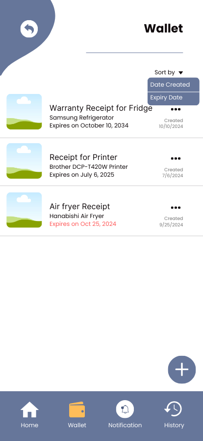
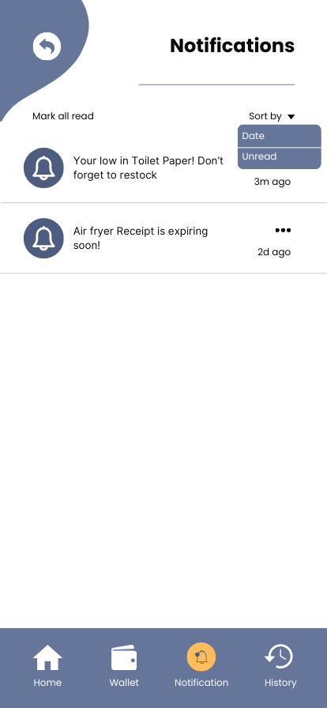

# HomeVault App
HomeVault is an android application designed to help users manage and track their home inventory, including appliances, electronics, furniture, and personal items. The app provides an efficient way to record item details, monitor warranty periods, and manage home supplies through notifications and an integrated camera functionality.

## 📱 UI Design
*Note: These high-fidelity mockups served as the primary reference for the final UI implementation.*

.png)

.png)
.png)

